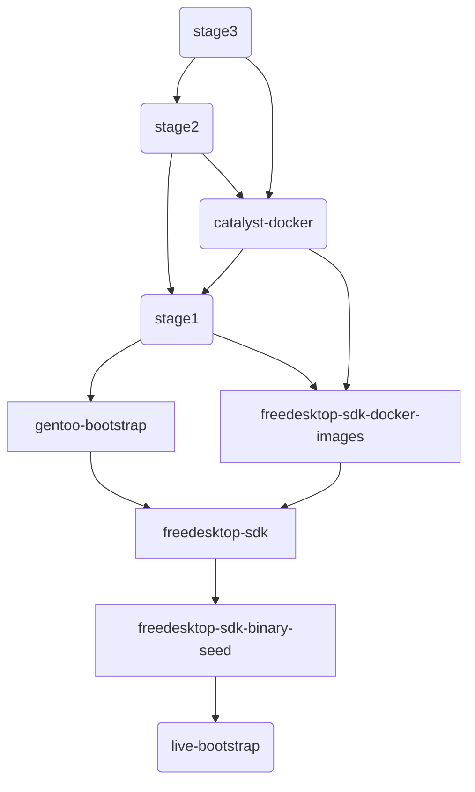

A Buildstream project that bootstraps Gentoo stage1 images. The image is based on [Freedesktop SDK](https://freedesktop-sdk.io), which rooted in [live-bootstrap](https://github.com/fosslinux/live-bootstrap).

There are two end elements:
* stage1-image.bst: The stage1 image built by this project
* catalyst-docker.bst: A docker image built by this project that runs [catalyst](https://wiki.gentoo.org/wiki/Catalyst), which can be used to build stage2/stage3 images.

The build sequence illustrated:

The build sequence is manifested in the Makefile.

It is expected to run on an x86_64 host for now. You need to set up riscv64/loongarch64 qemu-binfmt to build images for these ISA's.
